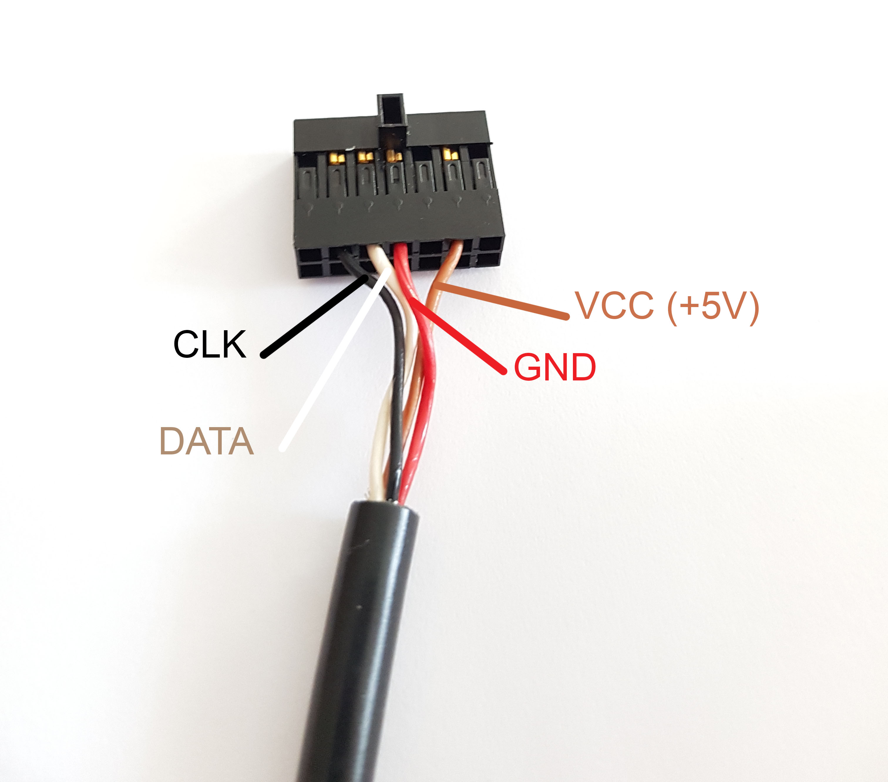
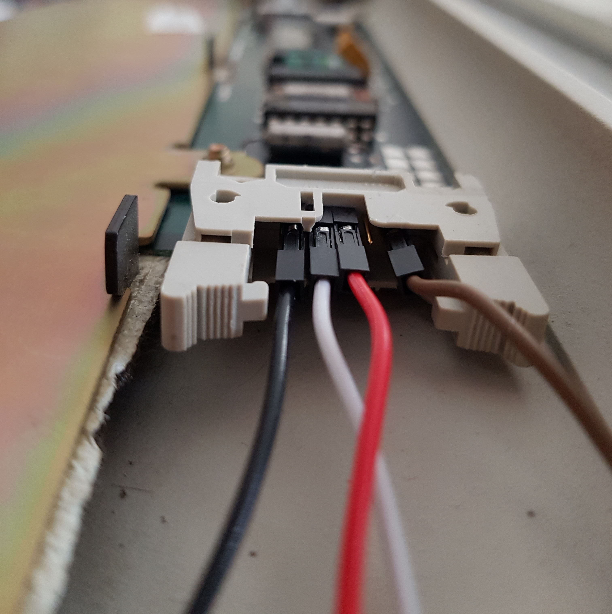
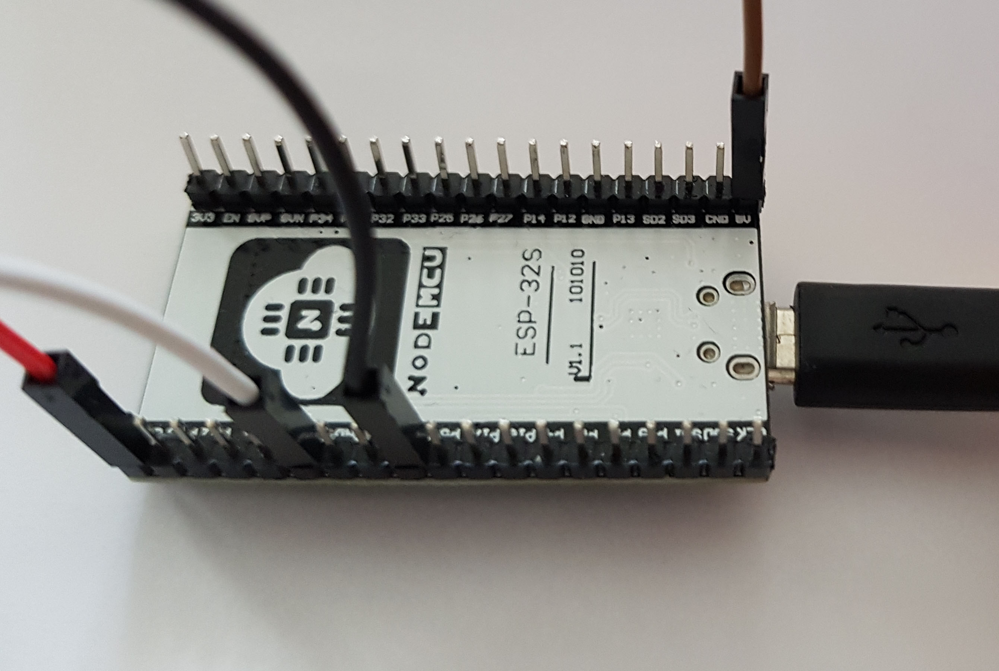
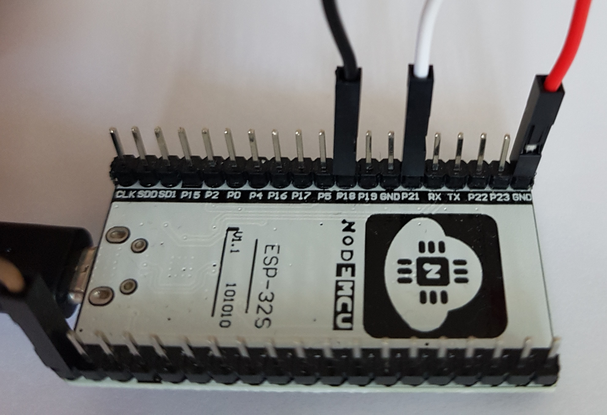

# IBM-Model-F-XT-Keyboard-ESP32
This project aims to bring back to life the old but well-designed and ultra-durable IBM Model F XT Keyboard with a modern microcontroller, the ESP32.

## Table of Contents
* [Project Status](#project-status)
* [Recognize Your Keyboard](#recognize-your-keyboard)
* [Wiring](#wiring)
* [Getting Started](#getting-started)
* [More Informations](#more-informations)
* [Authors](#authors)
* [License](#license)

## Project Status

  

## Recognize Your Keyboard
IBM Model F and Model M are very similar, but the internal circuitry is different. Furthermore, keyboards made during 80s used to implement two different protocols: XT and AT protocol.

## Wiring

## Getting Started
1. Connect the wires. Feel free to use whatever pin you want (remembering to change it in the sketch).
2. Upload the sketch using the Arduino IDE and the ESP32 plug-in
3. Plug ESP32. It needs power.
4. Connect to the ESP32 BLE interface (from your Bluetooth settings). This microcontroller is not able to simulate an HID device through USB interface, but it supports BLE HID. For a more neat solution see Teensy devices.
5. [optional] You can always change the keys mapping by modifying the translationTable array.

## More Informations
To learn more about XT protocol and Teensy solution see:
 - http://www.ccgcpu.com/2019/02/14/the-xt-part-4-adapting-a-modernish-keyboard/
 - https://deskthority.net/wiki/IBM_Model_F
 - https://github.com/tmk/tmk_keyboard/wiki/IBM-PC-XT-Keyboard-Protocol
 - https://deskthority.net/viewtopic.php?t=12597

## Authors

 - Francesco Mecatti - I.T.I.S Enrico Fermi - Italy, Modena

## License
This project is licensed under the MIT license - see the [LICENSE.md](license.md) file for details

